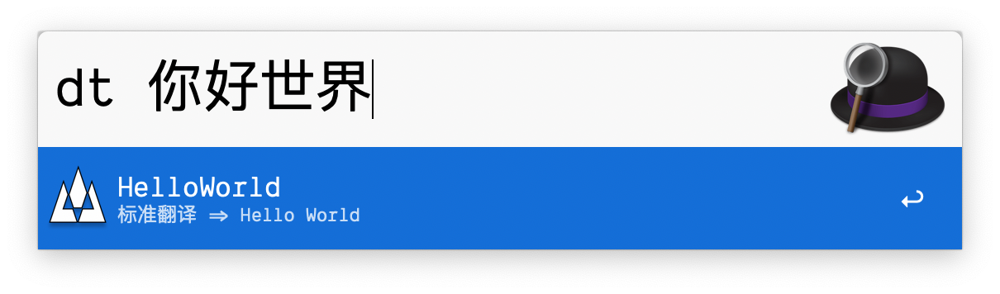
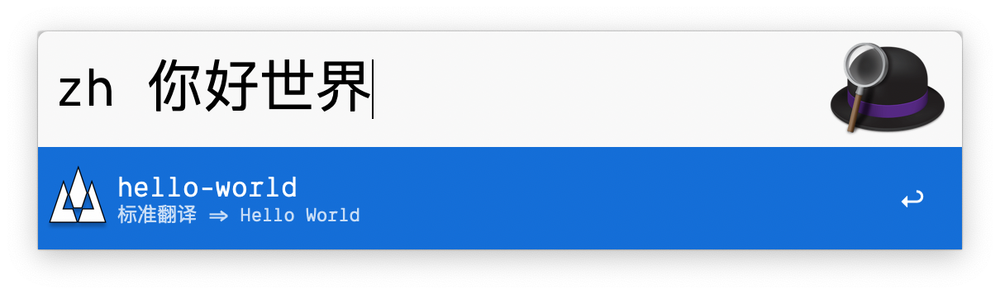
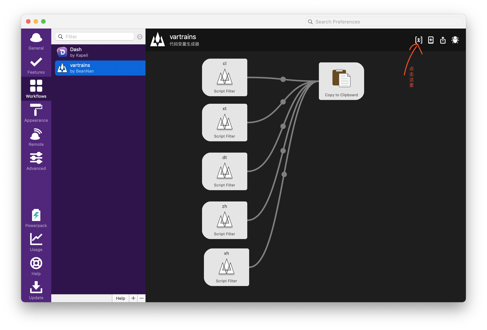
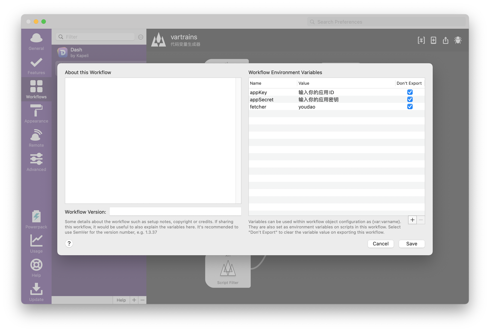

# vartrans

## 1. 介绍

vartrans为golang实现的**生成可用代码变量**的Alfred插件

### 1.1 优点

1. 无须安装其他依赖，安装即用(再也不用安装node了)。
2. 多翻译平台的支持，可自定义配置选择对应的翻译API。

### 1.2 支持的翻译平台

翻译平台 | 支持状态
-------- | --------
有道 | 已支持
谷歌 | 计划中

## 2. 效果

> 小驼峰命名法

> 大驼峰命名法

> 下滑线命名法

> 常量命名法

> 中划线命名法

## 3. 安装

[点此下载](https://github.com/BeanNan/vartrans/releases)

### 3.1 配置

| 对应翻译API平台的认证信息是需要自己去申请的，然后通过环境变量的方式注入进去，互联网的共享我个人认为
不适用密钥的分享。

#### 3.1.1 有道

前往[有道智云](http://ai.youdao.com/)注册翻译应用，最终拿到应用ID和应用密钥。在Alfred workflow页面上进行配置

环境变量配置：
变量名称 | 变量值
-------- | --------
fetcher | youdao
appKey | 有道注册的应用ID
appSecret | 有道注册的应用密钥

## 4. 参考

[CodeVar](https://github.com/xudaolong/CodeVar)